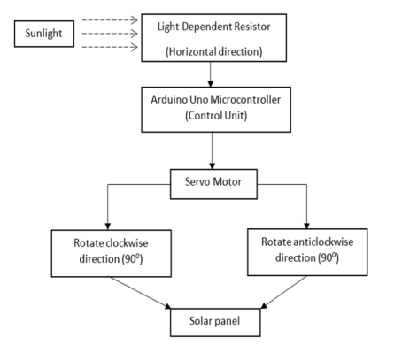
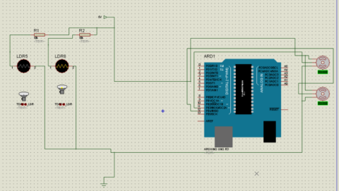
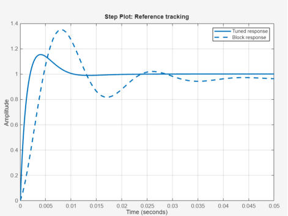
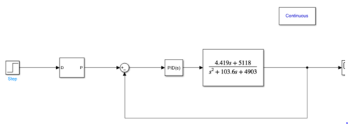

# Solar-Tracker-Control-for-Maximum-Solar-Irradiance
Solar Panel Tracker using Arduino, PID Controller, LDRs, Servo Motors

https://github.com/user-attachments/assets/41073b0a-213a-4c2d-98b4-d02e8661b075

This project focuses on the design and implementation of a solar power tracker using Light Dependent Resistors (LDRs), an Arduino Uno microcontroller, a servo motor, and a solar panel. The primary objective is to maximizethe efficiency of the solar panel by orienting it towards the direction of maximum sunlight throughout the day. This is achieved through the implementation of a Proportional Integral Derivative (PID) controller algorithm in the Arduino Uno, which continuously adjusts the position of the solar panel based on the readings from the LDRs. The project demonstrates the feasibility and effectiveness of using a PID controller for solar power tracking, and by maximizing exposure to sunlight, the project underscores the potential of PID control mechanisms in enhancing solar panel efficiency, thereby advancing renewable energy utilization.

- ##### **Dynamic Solar Tracking:** Utilizes LDR sensors to measure sunlight intensity from two different directions. #####  
- ##### **PID Control Optimization:** Fine-tuned in MATLAB to efficiently regulate the solar panel’s positioning.  #####
- ##### **Simulation & Testing:** Circuit modeled in Proteus, with PID parameters refined through MATLAB analysis. ##### 
- ##### **Hardware Implementation:** Arduino-driven servo motors dynamically adjust the solar panel’s alignment. #####

### Hardware: Arduino Uno, SG90 servo motors, LDRs, and a solar panel. ###
### Software: Arduino IDE, MATLAB, Proteus ###

For PID Controller I used the MATLAB PID block and obtained the values of Kp, Ki and Kd from the “PID tuner” function in MATLAB. We then plotted curves after tuning our model along with the transfer function of the servo motor we that we used. The curves plotted in MATLAB are shown below

These values of Kp, Ki, Kd were then used and implented in the Arduino Code in the main.cpp file

## References ##
###### PID-Arduino Reference: https://www.arduino.cc/reference/en/libraries/pid/ ######
###### Analysis of Arduino based tracker: https://iopscience.iop.org/article/10.1088/1742-6596/2051/1/012011 #####

